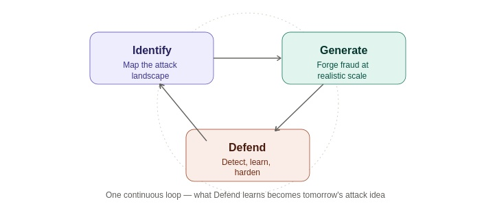
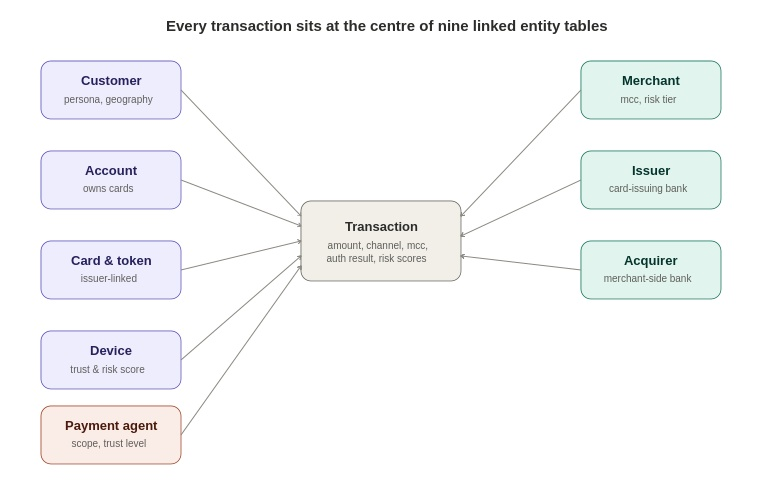
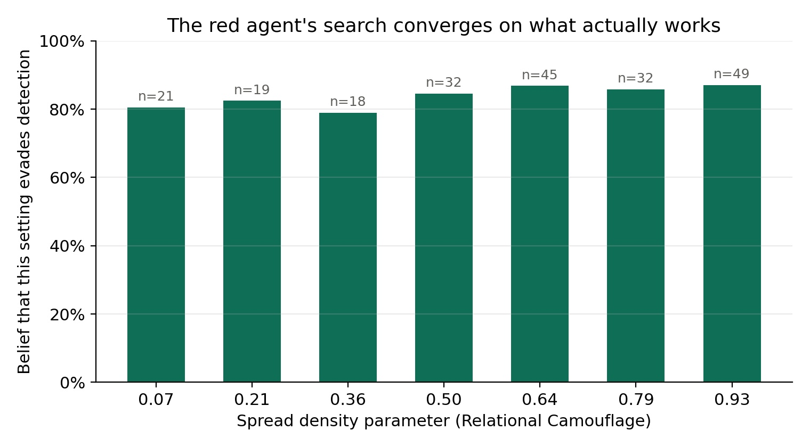

# Steelman

**Forging the fraud your defenses haven't seen yet.**

 Steelman is an AI-driven fraud defense platform purpose-built for card payment networks, simulating the complete payment ecosystem to proactively identify and defend against emerging GenAI-powered fraud. Calibrated using the IEEE-CIS Fraud Detection and PaySim datasets, it models the full payment network—including customers, accounts, cards, devices, merchants, banks, and autonomous payment agents—and generates realistic transaction data at a 2% fraud rate. 
 
 Its core architecture is a closed-loop AI red team–blue team framework, where an LLM-powered strategist and statistical search agent continuously generate and optimize attacks across thirteen GenAI-native fraud families, while a graph-enhanced detection model learns from these attacks to uncover and close security gaps.
 
  Steelman achieves 100% recall on classical fraud types such as Account Takeover, Velocity Abuse, and Device Compromise, and 74–78% recall on novel attack categories including Agent Identity Spoofing and Adaptive Card Testing. By continuously stress-testing its own defenses and discovering hard-to-detect behavioral mimicry attacks, Steelman provides an explainable, scalable, and future-ready approach to securing card payment ecosystems.

---

## 1. Steelman's Approach

Payment fraud detection is usually built as three separate jobs: mapping the threat landscape, building synthetic data, and training the classifier. Steelman treats these as one continuous loop.


*Figure 1. Steelman is one continuous loop. What the detector learns about its own blind spots becomes the next round of attack ideas.*

---

## 2. What's Here (Three Pillars, One Loop)

| Pillar | What it does | Where |
|---|---|---|
| **Identify & Generate** | A payment ecosystem simulator (9 entity tables, 13 GenAI-native attack families out of 34 mapped vectors) | `payment_environment_v24.py` |
| **Generate** | An AI red team — an LLM strategist (Gemini 3.5 Flash) plus a Thompson-sampling statistical search algorithm | `red_strategist.py`, `red_bandit.py` |
| **Defend** | A gradient-boosted classifier detector trained on observable transaction and graph features, retrained on red team output | `blue_model.py` |

---

## 3. The Simulated Ecosystem

Every transaction generated sits at the centre of nine linked entity tables calibrated against public statistics from the IEEE-CIS Fraud Detection and PaySim datasets at a realistic 2% fraud rate.


*Figure 2. Steelman's entity model. Nine linked tables give every transaction the same relational structure a real card network's data warehouse would have.*

| Entity Table | What it represents | Key fields |
|---|---|---|
| **Customer** | The account holder | persona, home country/city, account age |
| **Account** | A customer's banking relationship | owns one or more cards |
| **Card & token** | The payment instrument | issuer link, tokenised identifier |
| **Device** | What the transaction was made from | trust flag, OS risk score |
| **Merchant** | Who was paid | merchant category code (MCC), risk tier, geography |
| **Issuer** | The card-issuing bank | issues cards to customers |
| **Acquirer** | The merchant's bank | settles transactions for merchants |
| **Payment agent** | An AI assistant transacting on a customer's behalf | declared spend limit, allowed categories, trust level |
| **Transaction** | The event itself | amount, channel, category, authentication result, risk scores |

### Autonomous Payment Agents
Steelman models both legitimate payment agents transacting inside a declared scope and agents whose behaviour drifts outside it. This reflects early industry guidance on agent-initiated payments and tokenisation.

---

## 4. Thirteen GenAI-Powered Attack Families

Steelman simulates 13 parameterised attack families across 4 ecosystem layers selected from 34 researched payment fraud vectors.


*Figure 3. Steelman's thirteen attack families, grouped by the layer of the ecosystem they target.*

* **Authorization-time behaviour:** Behavioural mimicry, temporal mimicry, amount-distribution mimicry, adaptive card testing, classic card testing, velocity abuse, unusual geography.
* **Network structure:** Relational camouflage, merchant anomaly detection, device compromise clusters.
* **Identity & account:** Synthetic identity, account takeover.
* **Autonomous agents:** Agent identity spoofing, agent scope abuse.

### Behavioral Mimicry Example
Below is a real transaction pair generated by Steelman showing how the red agent alters a legitimate transaction to blend into victim history:

| Field | Legitimate Transaction | Steelman-Generated Attack |
|---|---|---|
| **amount** | ₹335.09 | ₹103.07 |
| **channel** | E_COMMERCE | E_COMMERCE |
| **merchant category** | RETAIL | RETAIL |
| **merchant city** | Mumbai | Chennai |
| **authentication result** | SUCCESS | SUCCESS |

---

## 5. The AI Red Team

Steelman's red team uses a split architecture: an LLM strategist combined with a statistical bandit.


*Figure 4. One cycle of Steelman's closed loop.*

1. **Strategist (Gemini 3.5 Flash):** Analyzes recent attack history, evasion rates, and parameter tuning to select the next attack family while logging plain-language reasoning.
2. **Bandit (Thompson Sampling):** Tunes continuous numeric parameters within the chosen attack family using evasion signal proximity.

---

## 6. The Detector & Performance

The detector is a gradient-boosted classifier using observable transaction signals and graph-aware features (e.g., shared-device customer counts, network component size).

### Overall Benchmark (16,500 unseen held-out transactions, 2% fraud rate)

| Metric | Value |
|---|---|
| **Precision** | 0.32 |
| **Recall** | 0.56 |
| **F1 Score** | 0.41 |
| **AUC-PR** | 0.51 |


*Figure 5. Steelman's detector evaluation across all 13 attack families.*

### Detection Recall by Attack Family


*Figure 6. Detection recall by attack family.*

* **Classical Fraud (100% Recall):** Account Takeover, Velocity Abuse, Device Compromise.
* **Emerging Agentic & Adaptive (57%–78% Recall):** Agent Identity Spoofing (78%), Adaptive Card Testing (74%), Agent Scope Abuse (57%).
* **Hard Mimicry Vectors (10%–31% Recall):** Relational Camouflage (31%), Amount Mimicry (27%), Behavioural Mimicry (12%), Temporal Mimicry (10%), Unusual Geography (0%).

---

## 7. Loop Convergence

When run across 30 generations and 594 campaigns, Thompson-sampling search parameters converge toward evasion-optimized parameters automatically.


*Figure 7. Red agent parameter search convergence under Relational Camouflage.*

---

## 8. Running Steelman

```bash
pip install -r requirements.txt
```

### 1. Generate the base dataset and train the baseline detector:
```bash
python payment_environment_v24.py --customers 1500 --merchants 150 --days 20 \
    --output data/blue_dataset_v2
python run_baseline.py
```

### 2. Run the closed loop:
Requires a Gemini API key (see [aistudio.google.com/apikey](https://aistudio.google.com/apikey)).

```bash
python run_closed_loop.py \
    --backend gemini \
    --api-key YOUR_KEY \
    --model gemini-3.5-flash-lite \
    --generations 30 \
    --campaigns-per-generation 20 \
    --retrain-every 5
```

Logs (`generation_log.json`, `comparison_log.json`, `strategist_reasoning_log.jsonl`, `final_debrief.txt`) are written to `output_v4/`.

### Alternative Execution Modes
* **Frozen Detector Loop:** `run_adversarial_loop_llm.py` runs the red team against an un-retrained detector.
* **Standalone Bandit Search:** `test_bandit_standalone.py` evaluates parameter search mechanics without LLM calls.

---

## 9. Dependencies & Repository Layout

```text
pandas, numpy, xgboost, scikit-learn, networkx, shap, openai
```

```text
payment_environment_v24.py    Simulator: entities, transactions, 13 attack families
blue_model.py                 Detector: graph feature extraction, training, scoring
red_bandit.py                 Thompson-sampling parameter search engine
red_strategist.py             LLM strategist & plain-language reasoning logger
run_baseline.py               Trains static baseline detector
run_closed_loop.py            Full red/blue adaptive closed loop
run_adversarial_loop_llm.py   Adversarial loop against a frozen detector
test_bandit_standalone.py     Standalone bandit search test script

data/
  blue_dataset_v2/            Generated base transactions
  calibration/                IEEE-CIS / PaySim calibration profiles

output_v2/blue_model_baseline/ Baseline static detector artifacts
output_v3/                    Frozen detector experiment logs & debrief
output_v4/                    Full closed-loop experiment logs & debrief
```

---

## 10. What's next

The closed loop's biggest open question: retraining the detector on the red
team's *successful* attacks alone gives only a small, inconsistent
improvement. The next step is training on its failed attempts too, so the
detector learns both sides of the decision boundary instead of just the side
that fooled it.
